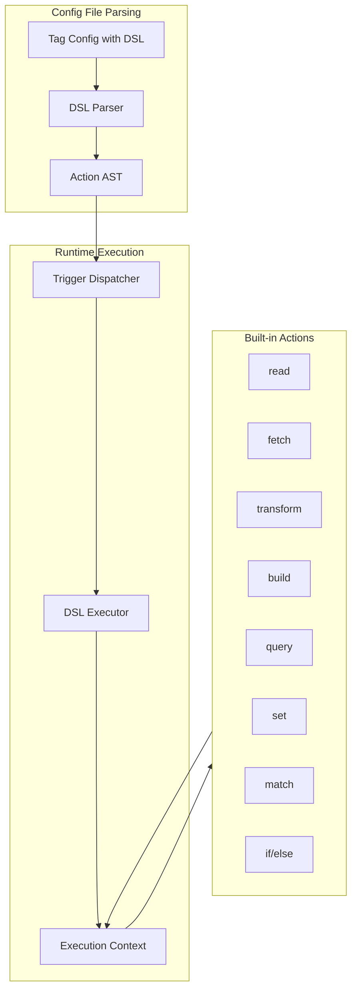

<!-- 84c48e6d-aaa5-41ee-8440-1cb8f8e2f02d 5f181b49-7dca-474c-977a-18e805c12455 -->
# DSL Parser Module for Tag Automations

## Architecture Overview



## New Files to Create

| File | Purpose |

|------|---------|

| [`src/dsl/types.ts`](src/dsl/types.ts) | TypeScript interfaces for AST nodes, patterns, context |

| [`src/dsl/parser.ts`](src/dsl/parser.ts) | Parse DSL syntax from config bullets into AST |

| [`src/dsl/patternMatcher.ts`](src/dsl/patternMatcher.ts) | Extract values from text using `{{var}}` patterns |

| [`src/dsl/executor.ts`](src/dsl/executor.ts) | Execute AST actions with context and error handling |

| [`src/dsl/actions.ts`](src/dsl/actions.ts) | Built-in action implementations (fetch, read, etc.) |

| [`src/dsl/index.ts`](src/dsl/index.ts) | Module exports and factory function |

| [`src/connectors/dslConnector.ts`](src/connectors/dslConnector.ts) | Connector that uses DSL engine |

## DSL Syntax Design

### Triggers (Entry Points)

```yaml
- #api-task Task description
  - config:
    - onTrigger:
      - read: `{{line}}`
      - fetch: `https://api.example.com/{{param}}`
        - method: POST
        - body: `{{payload}}`
      - transform: `Result: {{response.data}}`
    
    - onDone:
      - fetch: `https://hooks.example.com/complete`
    
    - onEnter:
      - read: `#podcast {{url}}`
      - fetch: `https://noembed.com/embed?url={{url}}` as: `meta`
      - transform:
        - #podcast {{meta.title}}
          - url: {{meta.url}}
          - channel: [{{meta.author_name}}]({{meta.author_url}})
          - {{cursor}}
```

### Pattern Syntax

| Pattern | Description | Example |

|---------|-------------|---------|

| `{{var}}` | Simple variable | `{{url}}` extracts URL |

| `{{var+}}` | Comma-separated list to array | `{{items+}}` → `["a", "b"]` |

| `{{var+;}}` | Custom delimiter | `{{items+;}}` splits on `;` |

| `{{var*}}` | Greedy match (rest of line) | `{{topic*}}` |

| `{{var:regex}}` | Regex-validated capture | `{{email:.*@.*}}` |

| `{{var?}}` | Optional (no error if missing) | `{{subtitle?}}` |

### Built-in Actions

| Action | Purpose | Syntax |

|--------|---------|--------|

| `read` | Read current line/file/selection | `read: \`{{line}}\`` |

| `fetch` | HTTP request with body/headers | `fetch: \`url\` as: \`var\`` |

| `transform` | Replace line/add children | Multi-line with indented bullets |

| `build` | Construct JSON object | `build: \`obj\`` with child key-values |

| `query` | Query tasks via TagQuery | `query: \`#tag\` as: \`results\`` |

| `set` | Set variable in context | `set: \`name\` value: \`val\`` |

| `match` | Pattern extraction | `match: \`pattern\` in: \`text\`` |

| `if` | Conditional execution | `if: \`{{condition}}\`` |

| `log` | Debug logging | `log: \`message\`` |

| `notify` | Show Obsidian notice | `notify: \`message\`` |

| `extract` | Regex extraction | `extract: \`/pattern/\` from: \`text\`` |

### Fetch Action Details

```yaml
- fetch: `https://api.example.com/endpoint`
  - method: POST
  - headers:
    - Authorization: Bearer {{token}}
    - Content-Type: application/json
  - body: `{{payload}}`
  - as: response
  - auth:
    - type: bearer
    - token: `{{secrets.api_key}}`
```

### Error Handling

All actions automatically wrap in try/catch. Errors append as child bullets:

```markdown
- [ ] #api-task my task ✗
  * Error: HTTP 401 Unauthorized (2024-01-15 10:30)
```

Custom error handling via `onError` block:

```yaml
- fetch: `https://api.example.com`
  - onError:
    - notify: `API request failed: {{error.message}}`
    - set: `fallback` value: `default`
```

## Key Implementation Details

### 1. Pattern Matcher ([`src/dsl/patternMatcher.ts`](src/dsl/patternMatcher.ts))

```typescript
interface PatternToken {
  name: string;
  type: 'simple' | 'list' | 'greedy' | 'regex' | 'optional';
  delimiter?: string;
  regex?: RegExp;
}

function parsePattern(pattern: string): PatternToken[];
function extractValues(text: string, pattern: string): Record<string, any>;
function interpolate(template: string, context: Record<string, any>): string;
```

### 2. Execution Context ([`src/dsl/types.ts`](src/dsl/types.ts))

```typescript
interface DSLContext {
  // Task context
  task: Task;
  line: string;
  file: TFile;
  
  // Extracted variables
  vars: Record<string, any>;
  
  // Special variables
  response?: any;
  error?: Error;
  cursor?: { line: number; ch: number };
  
  // Services
  app: App;
  taskManager: TaskManager;
  tagQuery: TagQuery;
}
```

### 3. DSL Connector Integration

Modify [`src/configLoader.ts`](src/configLoader.ts) to detect DSL config and create DSLConnector:

```typescript
// In resolveConfigForLine, detect DSL triggers
if (config.onTrigger || config.onEnter || config.onDone) {
  config.connector = 'dsl';
  config.dslConfig = parseDSLConfig(config);
}
```

### 4. Safe Execution Wrapper

```typescript
async function safeExecute<T>(
  action: () => Promise<T>,
  context: DSLContext,
  errorHandler?: (error: Error) => Promise<void>
): Promise<T | null> {
  try {
    return await action();
  } catch (error) {
    context.error = error;
    if (errorHandler) {
      await errorHandler(error);
    } else {
      await defaultErrorHandler(error, context);
    }
    return null;
  }
}
```

## Example Use Cases

### 1. Podcast Metadata Fetcher (onEnter)

```yaml
- onEnter:
  - read: `#podcast {{url}}`
  - fetch: `https://noembed.com/embed?url={{url}}` as: `meta`
  - transform:
    - #podcast {{meta.title}}
      - url: {{meta.url}}
      - channel: [{{meta.author_name}}]({{meta.author_url}})
      - {{cursor}}
```

### 2. Webhook with Auth (onTrigger)

```yaml
- onTrigger:
  - build: `payload`
    - task: `{{task.text}}`
    - completed: `{{task.completed}}`
    - file: `{{file.path}}`
  - fetch: `https://api.example.com/tasks`
    - method: POST
    - auth:
      - type: bearer
      - token: `{{secrets.API_TOKEN}}`
    - body: `{{payload}}`
```

### 3. Query and Aggregate (onDone)

```yaml
- onDone:
  - query: `#project-x` as: `tasks`
    - onlyCompleted: true
  - build: `summary`
    - total: `{{tasks.length}}`
    - items: `{{tasks}}`
  - fetch: `https://hooks.slack.com/...`
    - body: `{{summary}}`
```

## Integration Points

1. **ConfigLoader**: Detect DSL config, instantiate DSLConnector
2. **ConnectorFactory**: Register 'dsl' connector type
3. **Main.ts**: Wire up onEnter trigger in `applyTaskTagEnterBehavior`
4. **TagConnector**: DSLConnector extends this, overrides lifecycle methods

## Testing Strategy

- Unit tests for pattern matcher with various pattern types
- Unit tests for parser with nested bullet structures
- Integration tests for executor with mock HTTP responses
- E2E tests with sample tag configs in test vault

### To-dos

- [ ] Create DSL type definitions (AST nodes, context, patterns)
- [ ] Implement pattern matcher with all pattern types
- [ ] Implement DSL parser to convert config bullets to AST
- [ ] Implement built-in actions (read, fetch, transform, build, query)
- [ ] Implement DSL executor with safe error handling
- [ ] Create DSLConnector extending TagConnector
- [ ] Integrate DSL detection into ConfigLoader and ConnectorFactory
- [ ] Wire up onEnter trigger in main.ts editor handling