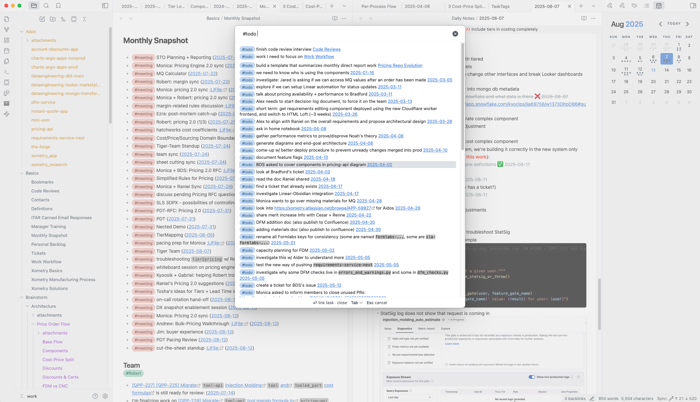

# Obsidian Plus Plugin
NOTE: This plugin is currently a work in progress, and not yet recommended for public use.


Here are the features it adds to Obsidian:

- utility logic to supercharge Dataview and Tasks plugins
  - ability to select/differentiate bullets/tasks anywhere in the vault based on additional parameters (position of tag, bullet format, etc.)
	- not just tasks, but regular bullets too
  - intelligently generate summaries based on info/context in child bullets
  - ability to interact with child bullets/tasks in dataview to build custom tag-specific summary logic
  - ability to expand/preview bullet content without needing to navigate to original page
- ability to assign specific colors to your tags
- ability to nominate special tags that are treated differently
  - tags that must be tasks
  - tags that fire side-effects / events
  - allowing tasksAPI to take credit for tasks checked off through dataview generated by this plugin
- tags that fire webhooks
  - ability to integrate w/ nocode solutions (Zapier, Bubble, Airtable, etc.)
- searchable task views/lists
  - lists that summarize tag notes
  - expand tags to show document outlines
  - stitch notes together from multiple days into continuous flow of thought
  - additional task shortcuts not offered by Tasks plugin (e.g. shift+click to cancel task)
- sticky header summarizing current context
  - useful when part of the context is out of view
  
Work in Progress:
- better summaries
  - using AI to summarize task context
- better integration with Tasks plugin
  - combining Tasks plugin syntax w/ this plugin's flexibility on how tasks get rendered
- more formatting customization
  - allowing user to customize formatting/coloring, not just content
- ability to receive webhooks
  - the idea is to create tasks automatically based on incoming requests
- "multiplayer tags":
  - ability to send/receive messages to other Obsidian Plus notebooks

- ability to generate webhooks from tasks/tags

## First time developing plugins?

Quick starting guide for new plugin devs:

- Check if [someone already developed a plugin for what you want](https://obsidian.md/plugins)! There might be an existing plugin similar enough that you can partner up with.
- Make a copy of this repo as a template with the "Use this template" button (login to GitHub if you don't see it).
- Clone your repo to a local development folder. For convenience, you can place this folder in your `.obsidian/plugins/your-plugin-name` folder.
- Install NodeJS, then run `npm i` in the command line under your repo folder.
- Run `npm run dev` to compile your plugin from `main.ts` to `main.js`.
- Make changes to `main.ts` (or create new `.ts` files). Those changes should be automatically compiled into `main.js`.
- Reload Obsidian to load the new version of your plugin.
- Enable plugin in settings window.
- For updates to the Obsidian API run `npm update` in the command line under your repo folder.

## Releasing new releases

- Update your `manifest.json` with your new version number, such as `1.0.1`, and the minimum Obsidian version required for your latest release.
- Update your `versions.json` file with `"new-plugin-version": "minimum-obsidian-version"` so older versions of Obsidian can download an older version of your plugin that's compatible.
- Create new GitHub release using your new version number as the "Tag version". Use the exact version number, don't include a prefix `v`. See here for an example: https://github.com/obsidianmd/obsidian-sample-plugin/releases
- Upload the files `manifest.json`, `main.js`, `styles.css` as binary attachments. Note: The manifest.json file must be in two places, first the root path of your repository and also in the release.
- Publish the release.

> You can simplify the version bump process by running `npm version patch`, `npm version minor` or `npm version major` after updating `minAppVersion` manually in `manifest.json`.
> The command will bump version in `manifest.json` and `package.json`, and add the entry for the new version to `versions.json`

## Adding your plugin to the community plugin list

- Check the [plugin guidelines](https://docs.obsidian.md/Plugins/Releasing/Plugin+guidelines).
- Publish an initial version.
- Make sure you have a `README.md` file in the root of your repo.
- Make a pull request at https://github.com/obsidianmd/obsidian-releases to add your plugin.

## How to use

- Clone this repo.
- Make sure your NodeJS is at least v16 (`node --version`).
- `npm i` or `yarn` to install dependencies.
- `npm run dev` to start compilation in watch mode.

### Task search filters

The fuzzy finder accepts lightweight search flags to narrow or expand task previews as you type:

- Use `status:<value>` to show only tasks whose checkbox matches the requested status character or alias (for example, `status:/` to focus on in-progress items). Values mirror the status cycle you configure for each tag.
- Use `expand:<mode>` to control how much child context renders inline with each task suggestion. `expand:none` keeps the default behavior of showing only the matching child line, `expand:focus` reveals the full outline for the currently highlighted suggestion, and `expand:all` expands every result at once.

You can combine these flags with regular keywords, and the fuzzy finder will trim them from the query before ranking results.

## Manually installing the plugin

- Copy over `main.js`, `styles.css`, `manifest.json` to your vault `VaultFolder/.obsidian/plugins/your-plugin-id/`.

## Improve code quality with eslint (optional)
- [ESLint](https://eslint.org/) is a tool that analyzes your code to quickly find problems. You can run ESLint against your plugin to find common bugs and ways to improve your code. 
- To use eslint with this project, make sure to install eslint from terminal:
  - `npm install -g eslint`
- To use eslint to analyze this project use this command:
  - `eslint main.ts`
  - eslint will then create a report with suggestions for code improvement by file and line number.
- If your source code is in a folder, such as `src`, you can use eslint with this command to analyze all files in that folder:
  - `eslint .\src\`

## Funding URL

You can include funding URLs where people who use your plugin can financially support it.

The simple way is to set the `fundingUrl` field to your link in your `manifest.json` file:

```json
{
    "fundingUrl": "https://buymeacoffee.com"
}
```

If you have multiple URLs, you can also do:

```json
{
    "fundingUrl": {
        "Buy Me a Coffee": "https://buymeacoffee.com",
        "GitHub Sponsor": "https://github.com/sponsors",
        "Patreon": "https://www.patreon.com/"
    }
}
```

## API Documentation

See https://github.com/obsidianmd/obsidian-api
